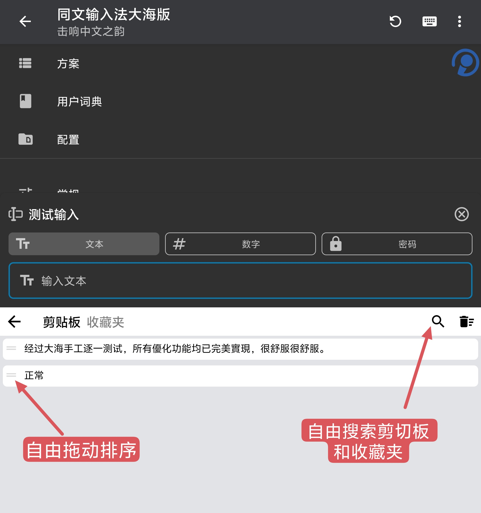
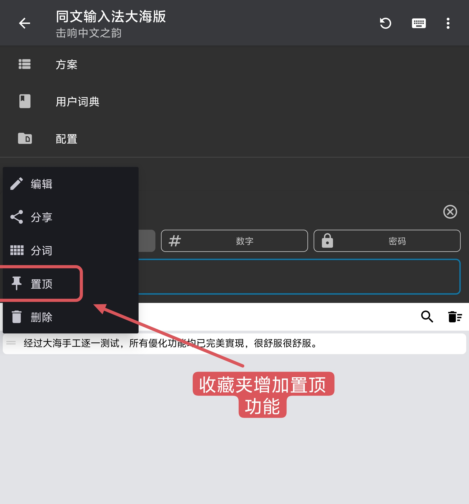
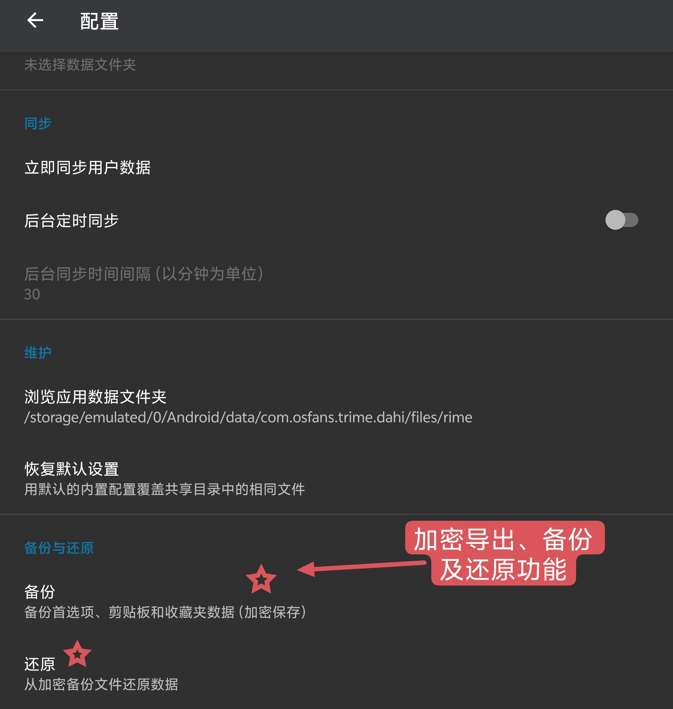
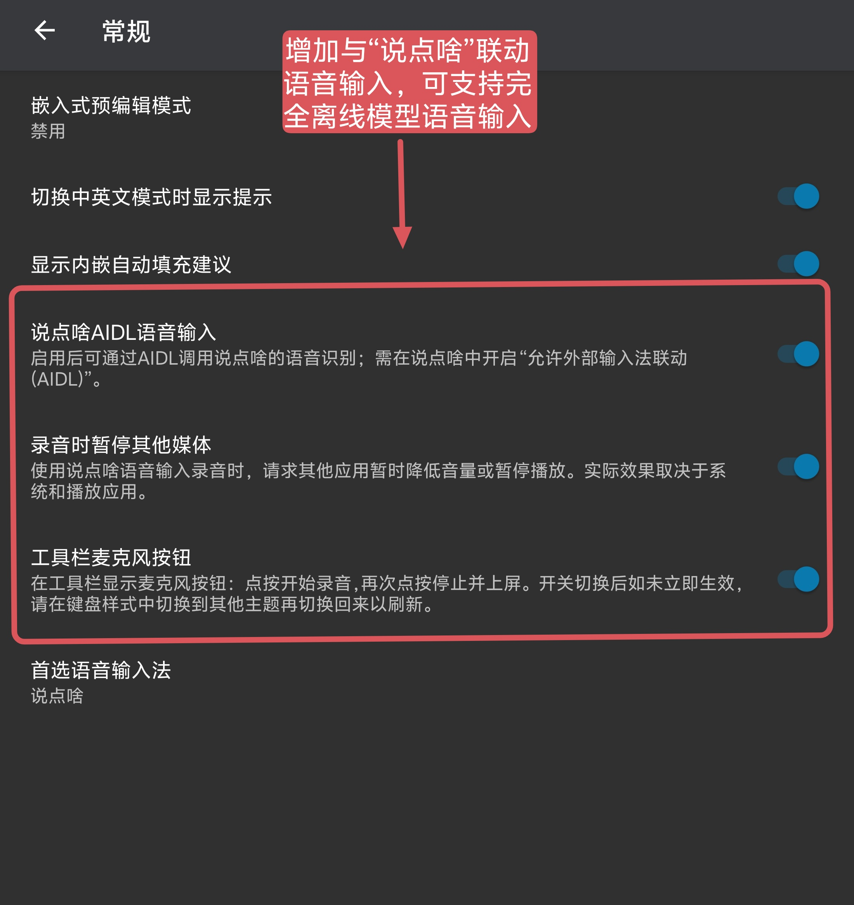

# 同文输入法 · 大海版

**基于同文输入法 (Trime) v3.3.12 的增强定制版【完全无联网权限】**
剪切板更强 · 备份加密更安心 · 支持「说点啥」语音（支持离线语音模型、隐私无忧；在线语音模型、自由选定） · 与原版共存

**[⬇️ 点此下载 APK](https://github.com/githubms68/trime-dahi/releases/latest)**

---

## 这是什么？

「大海版」是 [同文输入法](https://github.com/osfans/trime)（Rime 的安卓前端）的一个**增强 fork**：在完整保留原版体验的前提下，补齐了几个日常最想要、原版却缺的功能。

- 版本基准：**Trime v3.3.12**
- 应用名：**同文输入法大海版**
- 包名：**`com.osfans.trime.dahi`** —— 与官方原版**互不冲突，可同时安装**

> ⚠️ 本项目由个人维护，是**非官方**版本，与同文输入法官方无隶属关系。

## ✨ 相比原版新增了什么

### 1. 剪切板 & 收藏夹，终于好用了
- 🔍 **文字搜索**：剪切板、收藏夹都支持关键词搜索，条目再多也能秒找到。
- ↕️ **自由拖动排序**：条目左侧有拖拽把手，随意上下拖动，顺序自动保存。
- 📌 **收藏夹置顶**：收藏夹也支持「置顶」，重要内容永远排最前（行为同原版剪切板）。

### 2. 配置页新增「备份与还原」（**加密**）
- 一键备份 **首选项 / 剪切板 / 收藏夹**；换机、刷机、重装后一键还原。
- 🔐 **全程加密**：备份文件采用 **AES-256-GCM** 认证加密，密码经 **PBKDF2-HMAC-SHA256（20 万次迭代）** 派生。**绝不明文落盘**，文件被他人拿到也读不出内容。

### 3. 支持「说点啥」语音输入（支持离线语音模型、隐私无忧；在线语音模型、自由选定）
- 「常规」设置新增 3 个开关：**说点啥 AIDL 语音输入 / 录音时暂停其他媒体 / 工具栏麦克风按钮**。
- **长按空格键**或点**工具栏麦克风**即可语音输入，识别结果自动上屏。
- 语音功能需自行安装「说点啥」，https://github.com/BryceWG/BiBi-Keyboard；https://bibi.brycewg.com/。
- **注意**与「说点啥」联动，很多用户初次使用都会遇到语音输入时“未找到说点啥服务”提示问题，其实并不是应用和权限问题，解决只需要切换手机应用后台界面，将「说点啥」锁定🔐 后台常驻即可。

### 4. 与原版共存
- 独立包名，与原版同文都能一起安装，随时切换、互不覆盖。

## 📸 截图

<!-- 把截图放进 docs/ 目录，替换下面路径即可 -->
| 剪切板\收藏夹搜索 & 拖动排序 | 收藏夹增加置顶 | 加密备份与还原 | 语音输入开关 |
|:---:|:---:|:---:|:---:|
|  |  |  |  |

## 📥 下载与安装

1. 打开 **[Releases](https://github.com/githubms68/trime-dahi/releases/latest)**，下载最新的 **`...-arm64-v8a-release.apk`**（现代手机都选这个）。
2. 传到手机安装（首次可能需允许「安装未知来源应用」）。
3. 在系统「语言和输入法」中启用「同文输入法大海版」并切换过去。
4. 首次使用会自动部署 Rime 方案，稍等片刻即可开始打字。

支持 ABI：`arm64-v8a`（推荐）/ `armeabi-v7a` / `x86` / `x86_64`。

## ❓ 常见问题

- **能和官方同文一起装吗？** 能，包名不同，互不影响。
- **语音点了没反应？** 需先安装「说点啥」输入法，并在其中开启「允许外部输入法联动 (AIDL)」。本应用**不含**「说点啥」。
- **提示来源/签名异常？** 个人自签名、非应用商店分发，属正常现象。
- **以后怎么更新？** 到 Releases 下载新版覆盖安装。**更新前建议先用本版自带的加密备份**。

## 🙏 致谢

- [osfans/trime](https://github.com/osfans/trime) —— 上游同文输入法
- [amzxyz/rime-wanxiang](https://github.com/amzxyz/rime-wanxiang)—— 「万象拼音」：把算法留在幕后，把纯粹还给指尖，用更优质的数据，接管你的候选。
- [rime/librime](https://github.com/rime/librime) 及整个 Rime 生态
- [lzlv312/CatTrime](https://github.com/lzlv312/CatTrime)
- [osfans/trime-bibi-keyboard](https://github.com/BryceWG/trime-bibi-keyboard) 
- 「说点啥」输入法提供的语音联动协议

## 📄 许可

沿用上游许可 **GPL-3.0-or-later**，详见 [LICENSE](./LICENSE)。

